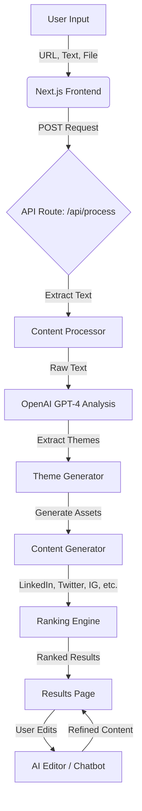

# ContentCycle - AI Content Repurposing Engine

## A. Problem Statement
Content creators, marketers, and businesses struggle to consistently repurpose long-form content (blogs, whitepapers, videos) into engaging, platform-native social media posts. Manually rewriting content for LinkedIn, Twitter, Instagram, and other platforms is time-consuming, repetitive, and requires a deep understanding of each platform's unique algorithms and audience preferences. This bottleneck limits the reach and ROI of high-value content.

## B. Solution Overview
ContentCycle is an intelligent AI-powered engine that automatically transforms any input (text, URLs, PDFs, DOCX, PPTX) into high-quality, platform-optimized social media assets.

*   **AI Approach**: We leverage OpenAI's GPT-4 models to deeply analyze the source content, extract "viral themes" and key insights, and then generate specific assets tailored to the tone and format of each platform (e.g., threads for Twitter, professional posts for LinkedIn, visual scripts for Instagram).
*   **Expected Impact**: Reduces content creation time by over 90%, ensuring consistent messaging across all channels while maximizing engagement through platform-native formatting.
*   **Value**: A "write once, distribute everywhere" workflow that empowers creators to scale their presence without scaling their effort. Includes a built-in AI Editor to refine content with real-time quality scoring.

## C. Architecture Diagram



**Workflow:**
1.  **Ingestion**: User provides a URL, uploads a file (PDF/DOCX/PPTX), or pastes text.
2.  **Processing**: The system cleans and extracts meaningful text from the input.
3.  **Analysis**: AI identifies core themes, hooks, and "why it spreads" factors.
4.  **Generation**: Platform-specific content (Threads, Captions, Scripts) is generated for selected channels.
5.  **Refinement**: User interacts with an AI Chatbot to tweak tone, length, or structure, with real-time scoring updates.

## D. Tech Stack

*   **Frontend Framework**: Next.js 14 (React)
*   **Styling**: Tailwind CSS, Radix UI, Lucide React
*   **Language**: TypeScript
*   **AI Integration**: OpenAI API (GPT-4 Turbo)
*   **Data Processing**:
    *   `mammoth`: .docx processing
    *   `jszip`: .pptx processing
    *   `pdf-parse`: PDF processing
    *   `cheerio` / `fetch`: URL scraping and HTML parsing
*   **State Management**: React Hooks (useState, useEffect)

## E. How to Run Your Project

Follow these steps to set up the project locally:

1.  **Clone the Repository**
    ```bash
    git clone <repository-url>
    cd contentcycleoffline_v2
    ```

2.  **Install Dependencies**
    ```bash
    npm install
    ```

3.  **Configure Environment Variables**
    Create a `.env.local` file in the root directory and add your OpenAI API key:
    ```env
    OPENAI_API_KEY=sk-your_openai_api_key_here
    ```

4.  **Run the Development Server**
    ```bash
    npm run dev
    ```

5.  **Access the Application**
    Open your browser and navigate to `http://localhost:3000`.

## F. API Keys / Usage Notes

*   **OpenAI API Key**: This project requires a valid OpenAI API key with access to GPT-4 models. The key is not included in the repository for security.
    *   Variable Name: `OPENAI_API_KEY`
    *   Location: `.env.local`

*   **Note**: Ensure your OpenAI account has sufficient credits. The application makes multiple API calls per request to analyze themes, generate content, and rank results.

## G. Sample Inputs & Outputs

**Input:**
*   **Source**: A URL to a technical blog post about "The Future of Generative AI".
*   **Selected Platforms**: LinkedIn, Twitter, Instagram.

**Output:**
1.  **Theme 1**: "AI as a Co-pilot, not a Replacement"
    *   **LinkedIn**: A professional, structured post discussing workforce augmentation with bullet points and a call for discussion.
    *   **Twitter**: A 5-tweet thread starting with a strong hook ("AI won't replace you. A person using AI will. Here's why... 🧵").
    *   **Instagram**: A visual description for a carousel ("Slide 1: The AI Myth...", "Slide 2: Reality Check...") with 30 relevant hashtags.

2.  **Theme 2**: "Ethical Considerations in LLMs"
    *   **LinkedIn**: A thought leadership piece on bias and safety.
    *   **Twitter**: A punchy, controversial take to drive engagement.

**AI Editor Interaction:**
*   *User*: "Make the LinkedIn post more casual."
*   *AI*: Rewrites the post with a friendlier tone, emojis, and simpler language, updating the "Tone" score in real-time.

## H. Video Demo Link

[Insert Video Demo Link Here]
